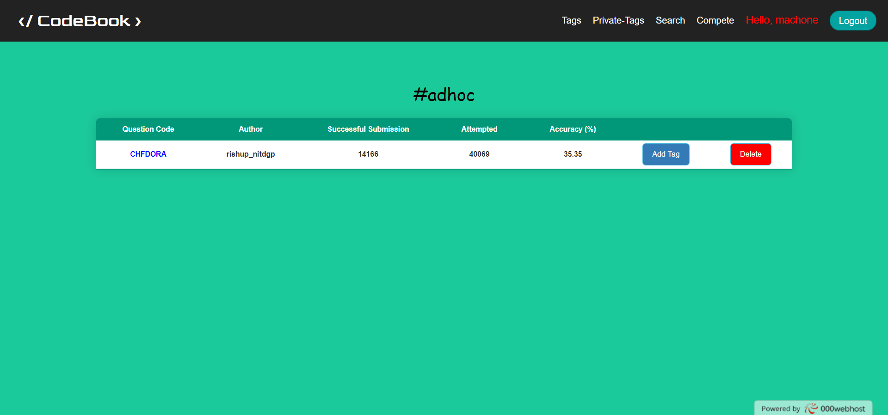
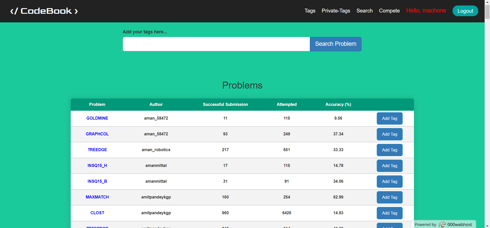
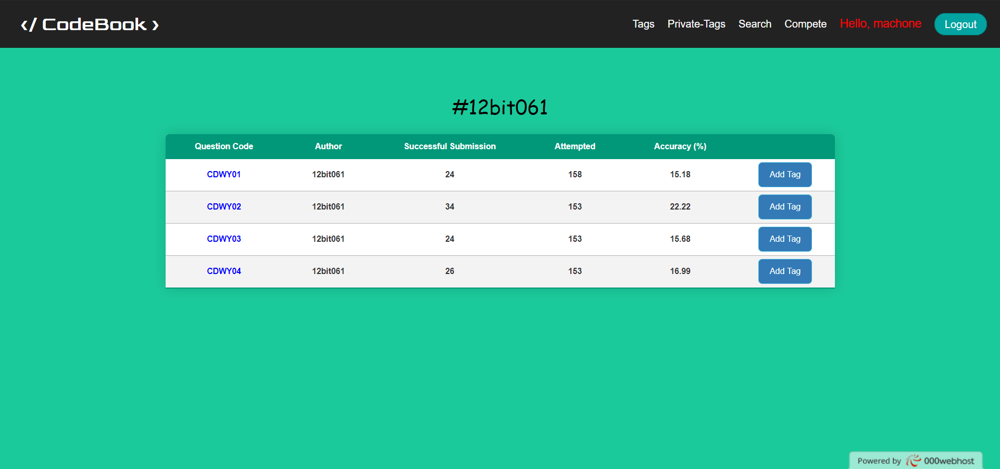

# Codebook
Codechef Internship Round - 2 Project

## Description
This is a project based on Codechef Summer Intern Round - 2 (Hackathon).

## Technology Stack
* HTML 
* CSS, Bootstraps
* JavaScript, Jquery
* PHP 
* Slim Framework
* MySQL

## ***Features***
### Basic features for Unauthorised Users:
* User can sort Codechef's questions on the basis of tag i.e authors and Competitive Programming's topic.
* User can visit the problem statement on Codechef by just clicking the question code in the given table.
* Various details such as number of attempts, successful submission and accuracy is also shown for each question in the table.
* User can search question via tags using search bar. Multiple tag search is also available in the search bar.
* This project has a very simple UI and easy to use.
### Some addition features for Authorised Users:
* An authorised user can add his private tag on a particular question. Those private tag will be accessible and seen only by the user himself.
* There is a separate section for private tag so that he can access them easy and efficiently.
* Private tags are also searchable in search bar.
* User can also delete a tag from a particular question as well as a complete TAG i.e remove tag from all those questions that hold that TAG.

## Here are some images of this project

### Project Link: [Codebook](http://codebook1106.000webhostapp.com)
Developed by ***Shreyansh Mehta*** (Codechef handler: mehtaji)      
College: Institute of Engineering and Technology, Devi Ahiliya Vishwavidhyalaya, Indore    
Branch: Information Technology    
Graduation Year: 2022
